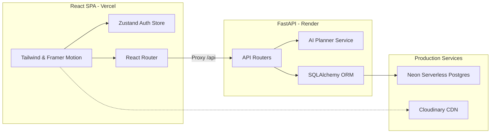

# Project Status & Architecture Snapshot — KeralaX AI

This document provides a high-level overview of completed milestones, upcoming priorities, known issues, technical debt, and the current system architecture before deploying to production.

---

## 1. Project Health Summary

- **Current State**: Stabilized. Frontend compiles with zero errors/warnings (except minified bundle size limit). Backend DB seeds and runs cleanly.
- **Git Branch**: `master` (All local modifications committed).
- **Working Tree**: Clean.

---

## 2. Completed Milestones

- **Core Base & Page Navigation**: Configured React Router routes mapping home page, explore dashboard, thematic regions, and destination reviews.
- **AI Journey Planner**: Programmed backend rule-based trip generation service (`ai_planner.py`) generating dynamic day-by-day travel schedules, hotel stays, directions, and packing guides.
- **Relational DB Normalization**: Structured database schema with normal form tables for regions, districts, destination mappings, activities, and ratings.
- **Dynamic Seeding Pipeline**: Programmed a data ingestion utility (`ingest.py`) reading and cleaning external travel datasets, synced automatically to SQLite/PostgreSQL on application startup.
- **JWT Authorization**: Programmed secure password encryption, authentication routers, and Zustand client state storage (`authStore.ts`).
- **Premium UI Redesign**:
  - Immersive full-screen visual hero slider with Ken Burns zoom effects.
  - Organic multi-layered SVG wave divider transitioning page headers.
  - Circular category quick-links matching the `Mézenc` design.
  - Interactive Map widget loading custom generated graphic map photos of Kerala and overlaying glowing pins linked to the region data panels (inspired by `epic` UI).
  - Staggered vertical booking steps layout inspired by the `MNTN` design.
- **Dockerization & Configuration Configs**: Multi-stage docker configs for Nginx frontend and Uvicorn backend, alongside ready-to-use `vercel.json` and `render.yaml` descriptors.

---

## 3. Current Architecture

---

## 4. Next Priorities & Roadmap

### Priority 1: Core Performance Remediations (Next Milestone)
- **Frontend Code-Splitting**: Configure Vite router code-splitting and dynamic `React.lazy` imports to divide the large JS bundle chunk (currently 605 kB, exceeding the 500 kB warning threshold).
- **Eager Loading Optimization**: Resolve SQLAlchemy database N+1 queries during destination lists fetching by implementing `joinedload` or subquery options.

### Priority 2: UX Enhancements (Important)
- **Map Detail Overlays**: Integrate detailed map markers inside destination detail pages.
- **Horizontal Scroll Indicators**: Add fading overlay gradient lines for categories lists.
- **Password Strength Indicators**: Implement realtime validation overlays inside the signup modal.

### Priority 3: Aesthetics (Nice-to-Have)
- **Skeleton Loaders**: Replace general loading spinners with custom card skeletons.
- **Single-Click Sharing**: Integrate social link generators for saved AI trip plans.

---

## 5. Known Issues & Technical Debt
- **Bundle Chunk Size**: The compiled index bundle is `605 kB` (warning is `500 kB`). This will be optimized via router-level code splitting.
- **SQLite vs Postgres Dialect Limits**: Postgres utilizes transaction isolation and SSL by default. Ensure database env vars are loaded with the `sslmode=require` query parameters in production.
