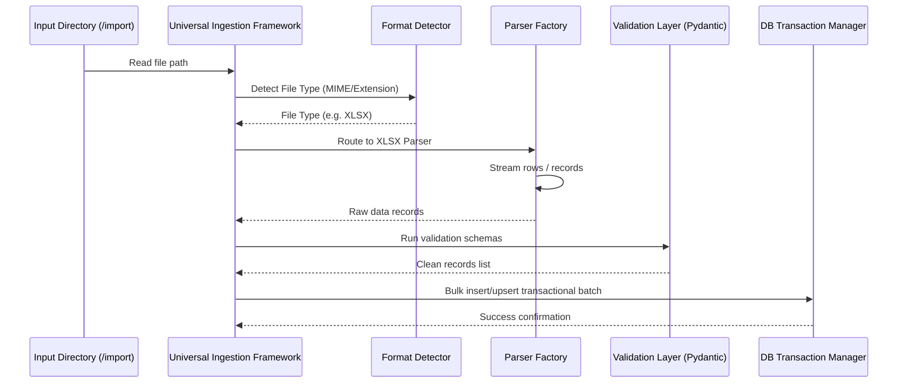

# Universal Ingestion Framework (UIF) — Architecture & Design

The Universal Ingestion Framework (UIF) is a reusable, modular, and data-driven data import engine designed to recursively process files of various formats (CSV, XLSX, JSON, MD, PDF, DOCX) and import them into the PostgreSQL/SQLite databases.

---

## 1. Architecture Architecture Overview



The design utilizes a **Factory Pattern** for routing file parses and a **Strategy Pattern** for the ingestion execution:

1. **Source Discovery Module**: Recursively walks the `/import` directory to build a queue of file paths.
2. **Format Detector Module**: Inspects file magic bytes (signatures) and extensions to identify the format.
3. **Parser Registry**: Holds instances of type-specific parsers. Routings are dynamic:
   - **CSV**: Standard library `csv.DictReader`.
   - **Excel (XLSX)**: Using `openpyxl` to stream worksheet cell rows.
   - **JSON**: Memory-efficient streaming parser (`ijson`) for large payloads.
   - **Markdown (MD)**: Frontmatter parser (YAML metadata) + markdown content parser mapping headings to fields (e.g., `# Description` maps to `description`).
   - **PDF**: Using `pypdf` to extract text blocks, parsed with regex templates.
   - **DOCX**: Using `python-docx` to iterate over paragraph structures.
4. **Validation Layer**: Reusable Pydantic models (e.g. `DestinationIngestSchema`) that clean inputs and verify coordinate boundaries and foreign references.
5. **Database Ingestion Manager**: Performs atomic bulk-inserts with conflict resolution (`ON CONFLICT DO UPDATE`).

---

## 2. Format Ingestion Logic

### Markdown Parser Mapping Example
For structured text data (e.g., travel articles or guides):
```markdown
---
name: Athirappilly Falls
district: Thrissur
category: waterfall
---
# Description
Athirappilly Falls is the largest waterfall in Kerala...

# Activities
- Trek to the base of the waterfall
- Nature photography
```
- **YAML Frontmatter** maps directly to metadata columns.
- **Section Headers (`# Header`)** map to matching description/highlight columns.
- **List items** map to JSON list arrays (activities, tags).

---

## 3. High Volume Performance & Scaling Strategy

To support hundreds of thousands of records (destinations, hotels, rooms, restaurants, transport tables) without memory depletion or request timeouts:

### 1. Memory-Safe Streaming
- **Generator Functions**: Parsers must use python `yield` statements to stream records row-by-row instead of reading entire files into memory.
- **Batch Processing**: Groups records into batches (e.g., 1,000 records) before validation and database insertions.

### 2. High-Performance Relational Writes
- **SQLAlchemy Bulk operations**: Use `db.bulk_insert_mappings()` or `db.execute(insert().values(), ...)` which avoids ORM overhead and compiles to single multi-row INSERT queries.
- **PostgreSQL COPY command**: For large CSV files, bypass SQL inserts entirely by using psycopg2's `copy_expert` utility to stream data directly into tables.

### 3. Asynchronous Queue Processing
- File ingestion runs as an asynchronous background worker task (via Celery or FastAPI background tasks).
- Processing status and audit logs are saved to `import_jobs` table to allow real-time UI progress updates.
