# Kerala AI Travel Platform — Database Architecture

## 1. ER Diagram

```mermaid
erDiagram
    REGIONS ||--o{ DISTRICTS : contains
    DISTRICTS ||--o{ DESTINATIONS : contains
    DISTRICTS ||--o{ WEATHER_STATIONS : hosts
    DESTINATIONS }o--o{ DESTINATION_CATEGORIES : "tagged via destination_category_map"
    DESTINATIONS ||--o{ DESTINATION_IMAGES : has
    DESTINATIONS ||--o{ DESTINATION_SEASONALITY : "rated per"
    SEASONS ||--o{ DESTINATION_SEASONALITY : defines
    DESTINATIONS ||--o{ ACTIVITIES : offers
    ACTIVITY_CATEGORIES ||--o{ ACTIVITIES : classifies
    ACTIVITIES ||--o| ADVENTURE_ACTIVITIES : "extends (1:1)"
    DESTINATIONS ||--o{ HOTELS : has
    HOTELS ||--o{ ROOM_TYPES : offers
    ROOM_TYPES ||--o{ HOTEL_PRICE_CALENDAR : "priced daily"
    DESTINATIONS ||--o{ RESTAURANTS : has
    DESTINATIONS ||--o{ TRANSPORT_HUBS : has
    TRANSPORT_HUBS ||--o{ TRANSPORT_ROUTES : "origin/destination"
    TRANSPORT_ROUTES ||--o{ TRANSPORT_SCHEDULES : runs
    DESTINATIONS ||--o{ FESTIVALS : celebrates
    DESTINATIONS ||--o{ WILDLIFE_SANCTUARIES : contains
    WILDLIFE_SANCTUARIES }o--o{ SPECIES : "hosts via sanctuary_species_map"
    WEATHER_STATIONS ||--o{ WEATHER_CURRENT : streams
    WEATHER_STATIONS ||--o{ CLIMATE_HISTORY : records
    DESTINATIONS ||--o{ CROWD_PREDICTIONS : forecasted
    DESTINATIONS ||--o{ DISTANCE_MATRIX : "origin/target"
    DESTINATIONS ||--o{ TRAVEL_TIME_MATRIX : "origin/target"
    USERS ||--|| USER_PREFERENCES : has
    USERS ||--o{ USER_TRIP_HISTORY : logs
    USERS ||--o{ ITINERARIES : owns
    USERS ||--o| USER_EMBEDDINGS : "AI vector"
    DESTINATIONS ||--o| DESTINATION_EMBEDDINGS : "AI vector"
    USERS ||--o{ RECOMMENDATION_LOGS : receives
    AI_MODEL_VERSIONS ||--o{ RECOMMENDATION_LOGS : produced_by
    AI_MODEL_VERSIONS ||--o{ ITINERARIES : "generated_by (nullable)"
    ITINERARIES ||--o{ ITINERARY_DAYS : contains
    ITINERARY_DAYS ||--o{ ITINERARY_ITEMS : contains
    ITINERARIES ||--o{ ITINERARY_BUDGET : allocates
    BUDGET_CATEGORIES ||--o{ ITINERARY_BUDGET : classifies
    PRICING_RULES }o--o{ PRICE_HISTORY : "informs (polymorphic entity_type/entity_id)"
```

> Note: `ITINERARY_ITEMS.ref_id` and `PRICING_RULES.entity_id` / `PRICE_HISTORY.entity_id` are **polymorphic references** (paired with a `type` enum column) rather than plain foreign keys, because a single itinerary slot or price rule can point at an activity, hotel room, restaurant, or transport route. This is called out explicitly below since Mermaid can't natively express polymorphic FKs.

## 2. Domain Modules & Relationships

**Geography spine** — `regions → districts → destinations` is a strict 1:N hierarchy that every other domain hangs off of. `destinations` is the hub table: hotels, restaurants, activities, festivals, wildlife sanctuaries, transport hubs, and weather stations all reference it. Keeping this spine normalized (rather than repeating district/region names on every row) is what lets one popularity/index update cascade correctly and keeps geospatial queries (`ST_DWithin`, `ST_Distance`) fast via a single `GEOGRAPHY(POINT,4326)` column per entity.

**Seasonality & weather** — `seasons` is a small static lookup; `destination_seasonality` is the M:N join carrying crowd/recommendation data per destination-season pair. `weather_current` (short-retention, partitioned monthly) and `climate_history` (long-retention, partitioned yearly, BRIN-indexed) both hang off `weather_stations`, which are geolocated and mapped to a district — not directly to every destination, since a handful of IMD stations cover many destinations.

**Activities** — `adventure_activities` is a **1:1 subtype extension** of `activities` (shared PK/FK pattern) rather than a duplicate table, so a query for "all activities near X" doesn't need a UNION, and adventure-specific columns (risk level, equipment) stay out of the base table's hot path.

**Hotels & dynamic pricing** — `hotels → room_types → hotel_price_calendar` mirrors real inventory systems (OTA-style). `hotel_price_calendar` is the highest-write-volume relational table in the schema (one row per room type per date) so it's range-partitioned by `stay_date` with the partition key folded into the primary key, as required by PostgreSQL.

**Transport** — `transport_hubs` (bus stands, jetties, stations, airports) connect via `transport_routes` (origin/destination hub pair) and `transport_schedules` (recurring departures). This lets the itinerary engine answer "how do I get from hub A to hub B, and when" without hardcoding routes per destination pair.

**Itinerary engine (core OLTP path)** — `itineraries (1) → itinerary_days (N) → itinerary_items (N)`. Each `itinerary_item` uses a `(item_type, ref_id)` pair instead of five nullable FK columns — this keeps the table narrow and index-friendly at the write volumes a "generate my 7-day trip" action produces (dozens of rows in a single transaction), while the composite index `(item_type, ref_id)` still lets you fetch "everywhere this hotel appears in any itinerary" efficiently.

**Budget planner** — `itinerary_budget` is a thin per-category (accommodation/food/transport/activities/misc) planned-vs-actual ledger keyed to one itinerary, deliberately separate from `itinerary_items.estimated_cost_inr` so the budgeting UI can aggregate/roll up without re-summing item rows on every page load.

**Distance & travel-time matrices** — precomputed, not calculated on the fly. For N destinations this is O(N²) rows, which is why both tables use a tight composite PK (`origin, target[, mode]`) and no surrogate key — it keeps the matrix small and lookups are always by that exact key, which is exactly what the itinerary optimizer needs during route sequencing (e.g., a TSP-style day planner doing hundreds of matrix lookups per generated itinerary).

**Peak crowd prediction & dynamic pricing** — `crowd_predictions` and `price_history` are both append-heavy, date-partitioned, ML-output tables (written by offline batch jobs, read heavily at request time). `pricing_rules` is the small, mutable rule set (seasonal/demand/festival multipliers) that a pricing service evaluates against `price_history`'s demand index to compute the live price shown to users — kept separate from `hotel_price_calendar` because pricing *rules* apply across entity types (hotel rooms, activities, transport, restaurant slots), not just hotels.

**AI recommendation layer** — `user_embeddings` and `destination_embeddings` store pgvector embeddings with `ivfflat` ANN indexes for sub-100ms nearest-neighbor lookups (the actual "AI matching" step). `recommendation_logs` captures every serve/click/book event, partitioned by time, and is the training-data source for the next `ai_model_versions` row — closing the ML feedback loop. `itineraries.ai_model_version_id` records which model produced a given AI-generated itinerary for auditability and A/B rollback.

**Users** — `users (1) — (1) user_preferences` is split out (not inlined) because preferences are updated far more often than identity data and are read on every recommendation call; keeping it a separate narrow table avoids bloating `users` with dead tuples from frequent updates (important under Postgres's MVCC at millions-of-rows scale). `user_trip_history` is the implicit feedback signal (separate from the explicit `recommendation_logs`) used to build `user_embeddings`.

## 3. Design Decisions for Scale (Millions of Users)

- **Partitioning**: every high-write, time-oriented table (`weather_current`, `climate_history`, `hotel_price_calendar`, `crowd_predictions`, `price_history`, `recommendation_logs`) is `PARTITION BY RANGE` on its date/timestamp column. This bounds index size per partition, allows old partitions to be dropped/archived cheaply (`DETACH PARTITION`), and keeps autovacuum scoped.
- **BRIN indexes** on strictly-increasing append-only date columns (`climate_history`, `price_history`) — far smaller and cheaper to maintain than B-tree at this row volume, since physical insertion order correlates with the date.
- **GIST indexes** on every `GEOGRAPHY` column — required for `ST_DWithin`/`ST_Distance`/`ST_Contains` to use an index instead of a sequential scan; this is what makes "activities near me" and radius search fast.
- **GIN + pg_trgm** on searchable `name` columns — powers fuzzy/typeahead search ("Munar" → "Munnar") without a separate search service.
- **ivfflat vector indexes** (pgvector) on both embedding tables — approximate nearest-neighbor search stays sub-linear even at millions of user embeddings, which is what keeps AI itinerary generation fast.
- **Precomputed matrices** instead of live geodesic/routing calculations inside the request path — the itinerary optimizer does O(1) lookups instead of calling a routing engine per candidate pair.
- **Narrow polymorphic tables** (`itinerary_items`, `pricing_rules`/`price_history`) over one-table-per-relationship-type — keeps row width and index count down at write-heavy tables.
- **UUID primary keys** on user-facing, horizontally-distributed entities (`users`, `itineraries`) so IDs can be generated client-side or across shards without a central sequence bottleneck; **BIGSERIAL/SMALLSERIAL** everywhere else, since those tables are centrally written and sequences are cheaper than UUID storage/index overhead.
- **Composite PKs without surrogate keys** on pure association/matrix tables (`destination_category_map`, `distance_matrix`, `hotel_price_calendar`, etc.) — avoids a redundant index and enforces uniqueness for free.
- **`updated_at` triggers** rather than application-managed timestamps — guarantees correctness regardless of which service writes the row.
- **Read scaling path** (not shown in DDL, operational note): this schema is designed to sit behind read replicas for the heavy read paths (destination browse, recommendation serve) with writes (bookings, itinerary generation) going to the primary — the partitioning and index choices above are what make replica lag manageable, since large partitions replicate independently.

## 4. Suggested Next Steps

- Add `PARTITION`-per-quarter creation as a scheduled job (`pg_partman` is a good fit) rather than manually pre-creating partitions.
- Add row-level security policies on `users`, `itineraries`, `user_preferences` if this schema serves a multi-tenant B2B layer (e.g. travel agencies) on top of direct consumers.
- Consider a materialized view (`refreshed hourly`) joining `destinations + crowd_predictions + hotel_price_calendar` as the itinerary engine's primary read source, so the AI planner never joins live OLTP tables directly.
